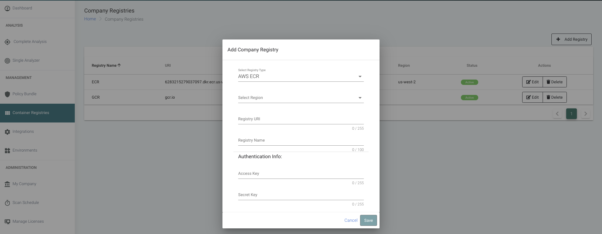

  

[](https://carbonetes.com)

  

***

  

# Table of Contents

-  [Introduction](#introduction)
-  [Prerequisites](#prerequisites)
	-  [Managing Registries](#managing-registries)
-  [Configuration](#configuration)
	-  [How to use the Carbonetes Orb](#orb-usage)
  

# Introduction

**Carbonetes Orb** provides comprehensive container analysis and policy evaluation as a fully managed service. Carbonetes analyzes your container images for native code vulnerabilities, software composition analysis (SCA), license types, bill of materials, malware, secrets. Carbonetes' powerful policy tool enables you to load standard policies or build , test and refine custom policies. It provides integrations with various container registries, CI/CD tools, as well as Slack and Jira.

**Carbonetes Orb** seamlessly integrates comprehensive container analysis directly into your CI/CD pipeline. Upon committing your code, the Team City plug-in automatically initiates a comprehensive container analysis scan. The results of that scan are compared to the applicable policy to determine whether the container should build or not. The insight from the analysis and the policy evaluation are embedded right inside Team City making it easy to find and resolve issues without ever leaving Team City.
  

# Prerequisites
 - The plugin requires a valid [Carbonetes](https://carbonetes.com) credentials (email and password).
### Managing Registries
 > After signing in to [Carbonetes](https://carbonetes.com), on the left sidebar, click on Container Registries. Then supply required fields and click save.




# Configuration

#### How to use the Carbonetes Orb
1. Follow the instructions at the [Orb Quick Start Guide](https://circleci.com/developer/orbs/orb/carbonetes_namespace/tcarbonetes#quick-start) to enable usage of Orbs in your project workflow.
2. In the app build job, call the `comprehensive/scan`
3. Set up an environment variable (**USERNAME**), (**PASSWORD**), (**REGISTRY_URI**) on your CircleCI environtment settings, which you can get from your Carbonetes account.

### Scan Image

```yaml
orbs:
  comprehensive: carbonetes_namespace/carbonetes@x.y.z
jobs:
  build:
    machine: true
    steps:
      - comprehensive/scan:
          username: '${USERNAME}'
          password: '${PASSWORD}'
          registryUri: '${REGISTRY_URI}'
          repoImageTag: 'busybox:latest'
          failOnPolicy: true
version: 2.1
workflows:
  carbonetes:
    jobs:
      - build:
          context: credentials
```

  > **Registry URI** the registry URI that is managed in [Carbonetes](https://carbonetes.com)
	
  > **Repo Image** the image that will be scanned by the plugin.
	
  > **Fail Build on Policy Evaluation FAIL result** if this is checked, the result of the **build** will fail if the result of policy evaluation is failed. Otherwise, ignored.
	
  > **Fail Build on Critical Plugin Error** if this is checked, the result of the **build** will fail if the plugin encounters error. Otherwise, ignored.

*Note : to be aligned in your CI/CD pipeline, make sure that you supply the same repository:imagetag that has been built within your pipeline stages. See below sample pipeline stages.* 


	
# License and Copyright

Copyright © 2020 Carbonetes

Licensed under [MIT License](LICENSE).